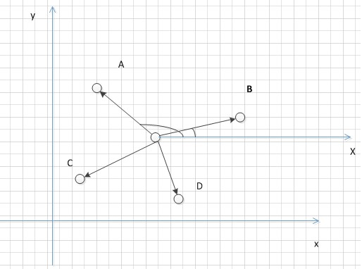
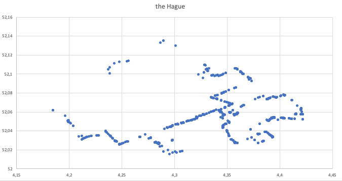
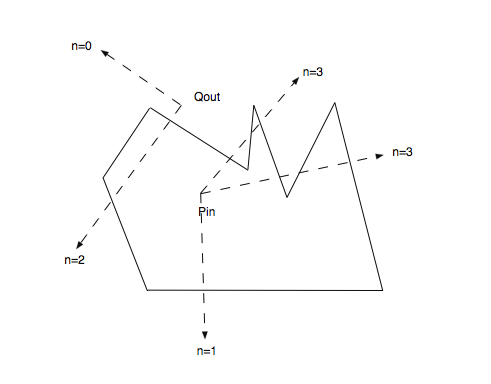
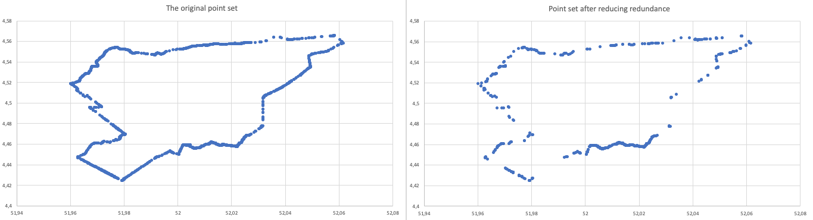
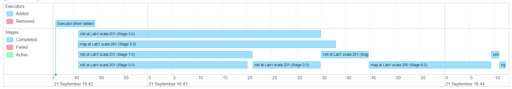
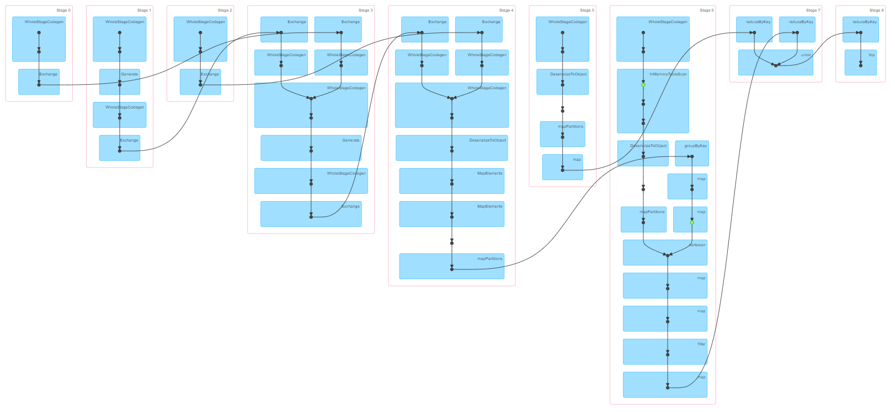
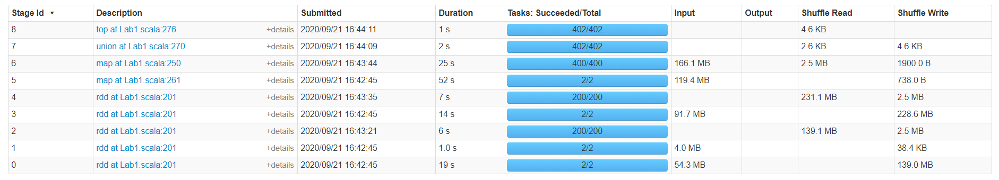

# Lab 1 Report

## Usage

1. Compile and package the source code in sbt.
2. Directly run: spark-submit target/scala-2.12/lab-1\_2.12-1.0.jar, with this case, please provide a dataset named "zuid-holland.orc" in your location. The default start location is the project folder.
3. Provide other database location: spark-submit target/scala-2.12/lab-1\_2.12-1.0.jar "OtherData.orc".
4. Provide specified filter angle: spark-submit target/scala-2.12/lab-1\_2.12-1.0.jar "default" "80" .

## Functional overview

Step 1. Import the database.  

Step 2. Filter the breweries and count the brewery with "city" tags.  

Step 3. Use location information to infer the city of breweries whose "city" tags are missing.  

Step 4. Combine and order the result.  

Our robustness level is 3, which means we make the most of geospatial calculations to produce an as-accurate-as-possible result. To make the results more accurate, we also try some computational geometry methods.    

The most challenging part of this lab is counting the breweries. It can be divided into two parts: the first part is filtering the breweries out and counting their "city" tags to analyze the brewery distribution in each city; the second part is appending the "city" tag for breweries that lack "city" tag via geometric information. The first part can be performed by Spark SQL queries and RDD MapReduce. As for the second part, two methods are possible to find the missing "city" tags.  

  
Figure 1: Sorting polygon points by angle  

The first method is determining which city a geographic point belongs to by computational geometry. The boundary information of each city is represented as a collection of ways and nodes. After extracting all the boundary nodes of a city, as is presented in Figure 1, we calculate the center of gravity of the convex polygon and construct the vector from the origin point to the center of gravity as the reference vector. The angle between the vector from the center of gravity to each fixed point and the reference vector are used to sort these nodes. The sorted nodes form a city boundary polygon. However, when we check the boundary of Den Haag (Figure 2), we can clearly see that this city has been divided into two polygons. Under this situation, the center of gravity will be outside the polygons, which causes wrong node sorting if we only consider the angle referred by the reference vector. To avoid this error, when obtaining the polygon nodes, we use their natural order as the boundary, thus avoiding calculation errors.  

  
Figure 2: Node collection of the Hague  

With the obtained polygon, any location point can be tested to be inside or outside the city, by making a ray from this point crossing the polygon and counting intersection points between it and the polygon boundary, as is shown in Figure 3. If the number of intersection points is odd, then the point is inside the city, otherwise the point is outside the polygon.  

  
Figure 3: Ray casting algorithm  

The second method is applying all locations with a "city" tag to perform KNN (k-nearest neighbors) algorithm to find out the most possible city for unknown breweries. The "city" tag of unknown breweries will be determined by its nearest city.   

Both of the above two methods can get relatively accurate "city" tags. Some other methods such as computing the distance from a certain point to a roughly-determined city point which is the average longitude and latitude of the point set containing the same city tags also work but not accurate enough.   

However, method two, KNN, is not realistic in this situation: the number of the brewery without the "city" tag is about 150 while there are nearly 1 million known locations to be determined as a neighbor or not. To find the nearest neighbor, the calculation is not affordable without high-performance computing. A compromise way is to calculate a subset of known location, however, the accuracy may degrade.   

## Result
 
As we can see in the following table, we list top 10 cities sorted by their number of breweries. Note that a brewery extremely close to city boundary may not be considered as in this city due to the ray casting limitation. In addition, the border information of some cities are missing in the OpenStreetMap, so they are directly ignored.  

City | Number
------------ | -------------
Rotterdam | 53
Den Haag | 50 
Leiden | 13 
Delft | 12 
Zoetermeer | 10 
Leidschendam-Voorburg | 7 
Pijnacker-Nootdorp | 6 
Nissewaard | 6 
Westland | 6 
Hoeksche Waard|6

Considering the particularity of this data set, we made some improvements to our results. First, some tags do not represent breweries but some alcohol or beverage shops. We did some filtering on the tags and only retained the following tags: "craft=brewery", "building=brewery", "industrial=brewery", "microbrewery=yes", "brewery=*". We only consider brewpub, craft and industrial breweries. Also, as we discussed before, the boundaries of some cities (such as The Den Haag) are not regular polygons and the use of a polygon sorting algorithm will bring great errors. Therefore, we use the node collection's natural order to obtain the boundary. As a result, the modified version gives the result as shown in the following table. In this situation, the number of cities is lower than 10.

City | Number
------------ | -------------
Rotterdam | 5 
Den Haag | 5 
Delft | 3 
Hillegom | 1 
Bodegraven-Reeuwijk | 1 
Midden-Delfland | 1 
Leiden | 1 

### Improvement: Reduce redundant polygon boundary points
One problem is that our sorted city boundary polygon contains too many nodes, and many of the adjacent nodes are highly redundant, which brings a lot of computation when we perform dataframe Cartesian product operations. In order to eliminate these points that are approximately on a straight line, we use the vector angle to filter. When we select a reference point, we compare the angle between the two vectors from another two points to this reference point. If the angle is less than a specified angle, we will filter out one of the points.   

Our test result indicates that the time has been reduced from 144 seconds to nearly 80 seconds by reducing redundant polygon boundary points. Test platform: Intel i5 9500 x6, the threshold angle is set to 10 degrees, the test result (Top 15) remains identical after applying the optimization.   

  
Figure 4: Reduce redundant polygon boundary points  

As we can see in Figure 4, the graph on the left is our original boundary, and the one on the right is the filtered boundary. When we connect these nodes in order, the boundary on the right can also represent the shape of the city boundary we need, the calculation speed is greatly accelerated, and it does not bring much error.  

### Improvement: Caching
Another bottleneck is that when we perform RDD Cartesian product operations, our data is frequently accessed in Cartesian product, so the time spent on IO and generating the new RDD is too long. To solve this problem, we apply caching before computing, which uses unserialized Java object format to store data in memory. Then the data that has been cached does not need to be recalculated from the source.  

## Scalability

In Spark applications, the data is distributed among all Spark workers. Different RDDs are executed on different workers and the dependency of RDD forms a DAG (Directed acyclic graph). Our application contains two branches, one is the counting breweries with "city" tag and the other one is the counting the breweries without "city" tag. Counting the tagged breweries is quiet fast and the other part is much slower due to the boundary calculation. The two parts should be capable to run on different spark workers.   

To make the application highly scalable, we have used map and filter for data processing as much as possible. As for the calculation of breweries without tags, the slowest part is the cartesian product in determining which city does brewery lies in. Hopefully, the RDD calculation can be performed on different Spark workers by partitioning data, which also meaning more Spark works will benefit our calculation.   

Due to the Spark features: lazy evaluation, the result will be collected after the last sentence of collecting results. Our application should have three parallel RDDs first and then soon turn into waiting for the bottleneck RDD, which is "cartesian product" RDD as mentioned befrore. Even through there is a bottleneck, there are no "collect" procedures before the lasts sentence and ideally data can be partitioned to different Spark workers to reduce the bottleneck.   

As abstraction packages the variation, the data source we applied in the lab is highly format-related, so it requires too much work to build an abstraction layer for data layer. It is possible but not affordable for Scala starter to build abstraction for some specific terms, such as the name of the column and the criteria of brewery.   

Despite the data structure interface, there are ways to manually specify the input file (other database with same structure is acceptable) and specify the filter arguments (introduced in Improvement: Reduce redundant polygon boundary points) to get a balance between performance and accuracy. The input file can be set to default by passing no arguments or passing "default" to the first argument. The filter argument should be an integer representing an angel in radius.    

## Performance

Combined all performance figures in appendix, we can gain the following insights.   

There are 9 stages in our application, for totally 80 seconds. Stage 0-4 is RDD operations where we select certain tags and filter data by some rules. Stage 6 applies the Cartesian product table union, determines whether a point is inside a city, and returns the breweries without "city" tags. The breweries with "city" tags are gained by Stage 5, combined with the Stage 6 results, are integrated into Stage 7. Finally, Stage 8 ranks all the city by their brewery number.   

In detail, stage 0-2 are parallelly executed by Spark's built-in operating mechanism. Stage 0 filters nodes, Stage 1 filters boundaries, and Stage 2 filters ways. Since the number of qualified nodes is more than 16,000,000, ways are about 2,400,000 and the number of city boundaries is much fewer, that's why Stage 0 takes 14s while Stage 1 only needs 1s. We notice that stage 5 has only two tasks but takes 47s, when we check its event timeline, we find that the actual time for execution is the 20s with 27s idling. This idle time is due to its resources are preempted by Stage 3 which has a higher priority, so it has to wait until Stage 3 is finished. The results of the last three stages depend on each other, so we can see that they are running serially. As expected, Stage 6 requires the longest time (24s) since it not only joins two RDDs but also implements the ray casting to determine whether the point is within the polygon. Although Stage 7 and Stage 8 both have 402 tasks, they just combine and rank data, such operations do not last long.   

The whole size of our original OpenStreetMap dataset is 192 MB. Though we have filtered most of the brewery data, Stage 6 still inputs 171 MB. That's because we use the Cartesian product, which expands the input table and the size is larger.   

### Reference
* Spark API, the Spark API for Scala language, https://spark.apache.org/docs/latest/api/scala/org/apache/spark/index.htm
* CSDN blog, the Ray casting algorithm, https://blog.csdn.net/k_wzzc/article/details/82779291
* CSDN blog, sorting polygon points algorithm, https://blog.csdn.net/k_wzzc/article/details/83066147
### Appendix
  
Title： Event timeline

  
Title： DAG

Title： Completed stages

