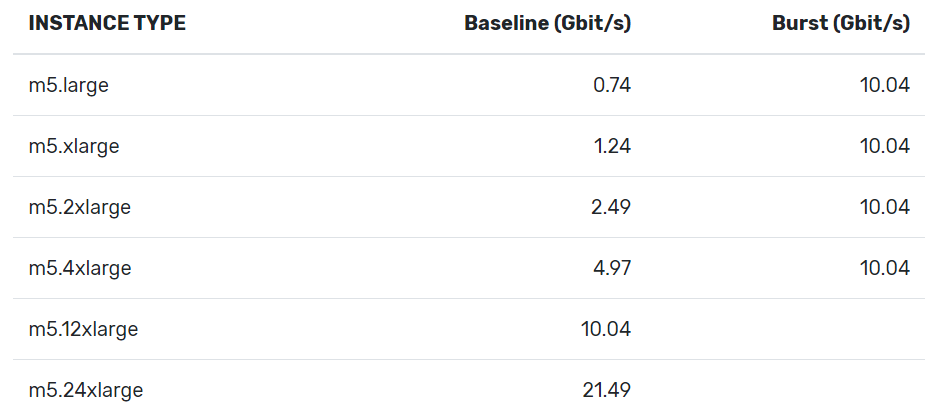

# Lab 2 Report

## Usage

To run our application in the AWS EMR, we need to perform the following steps:
- Build artifacts and package the project as a jar package by the Intellij IDEA.
- Create an EMR cluster and upload the jar package to the corresponding S3 bucket.
- Add EMR step to run the spark application with S3 jar package and specify "--class Lab2" "--num-executors"(and other Spark executor commands if necessary) as the spark-submit parameter.
- Check the AWS CloudWatch and Spark history server to monitor job status and relevant metrics.
- Check the Spark history server and output file to gain useful information.

Note that we have to change the orc path in line 125 when shifting to another dataset.

## Approach
 
 ### Iteration 0: Baseline
 Application structure:
 - Use Geomesa to create a polygonal point set for the city outline.
 - Use uber.H3 to transform the polygon to uber’s hexagonal hierarchical spatial index. 
 
 We find caching dataset before performing complex operations can greatly reduce the run time, so we apply two cache() operations before building H3 indexing and matching indexes.
 The baseline performance is given below:

 | | |
 |---|---|
 | System                  | c5.xlarge |
 | vCPU                    | 4 |
 | Memory                  | 8 GB |
 | Workers                 | 0 (Single Machine) | 
 | Dataset                 | Netherlands | 
 | Run time  (hh:mm:ss) | 00:15:04 | 
 | Cache                   | Enabled  |
 | H3 resolution           | 7 |

 | | |
 |---|---|
 | System                  | c5.xlarge |
 | vCPU                    | 4 |
 | Memory                  | 8 GB |
 | Workers                 | 2 | 
 | Dataset                 | Netherlands | 
 | Run time  (hh:mm:ss) | 00:10:31 | 
 | Cache                   | Enabled  |
 | H3 resolution           | 7 |

 | | |
 |---|---|
 | System                  | c5.xlarge |
 | vCPU                    | 4 |
 | Memory                  | 8 GB |
 | Workers                 | 5 | 
 | Dataset                 | Netherlands | 
 | Run time  (hh:mm:ss) | 00:04:15 | 
 | Cache                   | Enabled  |
 | H3 resolution           | 7 |
 

 ### Iteration 1: Optimize RDD cache and unpresist
 
When we inspected our application execution information, we found that our data was repeatedly read and written at different stages, taking too much extra time. Because we rely on Spark's lazy computing feature, we only cache the two H3 results when the index is finally paired. To avoid such time-consuming cost, we can add two cache() operations before join() operations in line 145 and line 193.
 
Our baseline implementation fails to process "us.orc" dataset, the error messages from Spark include "slave lost" and "YARN container lost connection". After looking through the materials on the Internet, we find the cause of this problem is our memory runs out and YARN is forcefully closed by the system. So we add configuration to Spark to increase the reserved memory: set "spark.yarn.executor.memoryOverhead" to 500/1000.

After that, our application still failed to process American dataset, we checked the log and find that there is not enough disk spacce for spark applications. So we begin to optimize our code, aiming for using less disk sapce.

All RDDs in Spark will be stored in memory or in disk and saving RDDs to disk requires serialization, which not only costs disk resources but also costs CPU resources. Considering these two factors, we decided to reduce the use of RDD and actively remove RDD (via unpresist API) once we don't use them. In theory, the modification should also save CPU resources because some serialization procedures can be avoided. 
 
 #### Additional minor Change: Use Spot Instance
 We turn to use AWS spot instance as worker instance because "spot" instance is much cheaper than on-demand instance. The AWS will allocate spot instances to consumers who claim the highest price from all unused EC resources. Considering Spark has fail tolerance and relatively short running time, we decide to use spot instance.
 The only drawback of spot instance is: our working instances might be shut down during running Spark applications. Ideally, the Spark driver can handle this(Spark driver should be run on "on demand" instance) and make sure the application can run on other executors.
 
 #### Additional minor Change: Use KryoSerializer
 Serializing structured data from memory to disk costs too much CPU resources. Besides, due to our memory limitation, our application will frequently serialize and deserialize data between memory, disk, and network, which definitely slows down the computation. By default, Spark serializes objects using Java’s ObjectOutputStream framework, which is flexible but often quite slow and leads to large serialized formats for many classes. Alternatively, we can switch to using the Kryo library to serialize objects more quickly. Kryo is significantly faster and more compact than Java serialization (often as much as 10x). However, it does not support all Serializable types and cannot serialize functions. We register Uber H3 classes but fail to register Geomasa classes.
 
After these changes, we can reach a performance as following:

 | | |
 |---|---|
 | System                  | m5.2xlarge |
 | vCPU                    | 8 |
 | Memory                  | 32 GB |
 | Workers                 | 5 | 
 | Dataset                 | Netherlands | 
 | Run time  (hh:mm:ss) | 00:02:14 | 
 | Cache                   | Enabled  |
 | H3 resolution           | 7 |

 | | |
 |---|---|
 | System                  | m5.xlarge |
 | vCPU                    | 4 |
 | Memory                  | 16 GB |
 | Workers                 | 5 | 
 | Dataset                 | America | 
 | Run time  (hh:mm:ss) | 00:11:14 | 
 | Cache                   | Enabled  |
 | H3 resolution           | 7 |
 
 | | |
 |---|---|
 | System                  | m5.xlarge |
 | vCPU                    | 4 |
 | Memory                  | 16 GB |
 | Workers                 | 5 | 
 | Dataset                 | Europe | 
 | Run time  (hh:mm:ss) | 00:41:20 | 
 | Cache                   | Enabled  |
 | H3 resolution           | 7 |

 
 ### Iteration 2: Improving Network Bandwidth
 
One bottleneck we encounter while testing our cluster is the network I/O bandwidth. We can either change our instance type or use enhanced networking to increase our bandwidth.

Limited by our start accounts, we can only use limited instance types. From the EC2 network performance cheat sheet we can see, 2xlarge has a much larger baseline than xlarge. So obviously, the best instance choice will be m5.2xlarge.

To gain better network performance, we can make use of AWS enhanced networking. Enhanced networking provides higher bandwidth, higher packet per second (PPS) performance, lower network jitter, and lower latencies. 

There are two main mechanisms to enable enhanced networking. 
- Elastic Network Adapter (ENA), which requires ENA module and support.
- Intel 82599 VF interface, which uses the Intel ixgbevf driver. 
Since Intel 82599 VF interface only works for C3, C4, D2, I2, M4 (excluding m4.16xlarge), and R3 instances, this method is not suitable for our instance type M5\C5. 

To enable ENA enhanced networking, we have to modify the configuration for our instances. However, due to the permissions of the educational account we use, we cannot create the access key and private key of the AWS user, and thus cannot be configured through the AWS CLI. To this end, we created our own AWS account and used more permissions to successfully enable the enhanced network. 

 ### Iteration 3: Try to process the planet data.
 When we try to process planet data, the executors always die due to not enough disk space. We tried the best instance in our edu account - 7 x m5.2xlarge (with 128G EBS storage), but it still fails due to the disk problem. After discussion, we think CPU and memory are not bottlenecks for us if we ignore the time, so we use our own AWS account to buy a cheap instance with the best and the largest EBS storage. The planet result is given below (Discard caching applied, mentioned later):
 
  | | |
 |---|---|
 | System                  | c5.xlarge |
 | vCPU                    | 4 |
 | Memory                  | 8 GB |
 | Workers                 | 5 | 
 | Dataset                 | Planet | 
 | Run time  (hh:mm:ss) | 01:45:00 | 
 | Input                   | 98.8 GB |
 | Shuffle Read            | 441 GB |
 | Shuffle Write           | 441 GB |
 | EBS Storage             | 1TB, with 3000IOPS |
 | Cache                   | Disabled  |
 | H3 resolution           | 6 |
 
We choose the best EBS storage and basic CPU/Memory because EBS storage is relatively much cheaper than CPU/Memory. With better instances such as m5.2xlarge, the performance would be much better.

#### Additional minor Change: Discard caching

As we discussed above, the caching mechanism can increase the computing speed. However, when we need to process Planet data (75.8 GB), our memory is not enough, and the default EBS disk size of c5.xlarge is 64GB, which obviously cannot store such a large amount of data. In order to be able to run through this large-scale data set, we abandoned the cache and expanded the disk capacity when the cluster was turned on.
The following result is obtained when we discard caching.

 | | |
 |---|---|
 | System                  | c5.xlarge |
 | vCPU                    | 4 |
 | Memory                  | 8 GB |
 | Workers                 | 5 | 
 | Dataset                 | Netherlands | 
 | Run time  (hh:mm:ss) | 00:03:34 | 
 | Input                   | 1.8 GB |
 | Shuffle Read            | 8.4 GB |
 | Shuffle Write           | 8.4 GB |
 | Network Input Burst     | 3.24 Gbps |
 | Network Output Burst    | 2.6 Gbps |
 | Cache                   | Disabled  |
 | H3 resolution           | 7 |

 | | |
 |---|---|
 | System                  | c5.xlarge |
 | vCPU                    | 4 |
 | Memory                  | 8 GB |
 | Workers                 | 6 | 
 | Dataset                 | America | 
 | Run time  (hh:mm:ss) | 00:10:02 | 
 | Input                   | 13.5 GB |
 | Shuffle Read            | 62.5 GB |
 | Shuffle Write           | 62.9 GB |
 | Network Input Burst     | 3.65 Gbps |
 | Network Output Burst    | 3.36 Gbps |
 | Cache                   | Disabled  |
 | H3 resolution           | 7 |

#### Some discussion about executor number chosen and executor memory chosen
When we try to process planet data, we tried different kinds of executor configurations such as "FAT executor" (5 executors, each with 8 cores and 20G memory, 128G EBS storage). We hope it can be capable of processing planet data, but it fails due to not enough disk. It seems that memory cannot determine whether a big data application can successfully finish or not while the disk can. Memory only determines whether we can cache our data to speed up.
After looking through some explanations on "FAT executor" and "TINY executor", we decide to let Spark allocate executors according to our cluster because "FAT executor" causes pressure for HDFS and "TINY executor" causes trouble for network and shuffle write.

### Iteration 4: Price comparison.
We make a price comparison after processing the world dataset. Here is the explanation and results.
- We use the American dataset as the test case due to its smaller data size.
- The total price is obtained by (run time) x (on-demand price).
- All clusters use a m5.xlarge as driver node.

 | | |
 |---|---|
 | System                  | m5.xlarge |
 | vCPU                    | 4 |
 | Memory                  | 16 GB |
 | Workers                 | 5 | 
 | Dataset                 | America | 
 | Run time  (hh:mm:ss) | 00:11:57 | 
 | Cache                   | Enabled  |
 | H3 resolution           | 7 |
 | Price per instance      | $0.192/h |
 | Total cost              | $0.1912  |
 
  | | |
 |---|---|
 | System                  | c5.xlarge |
 | vCPU                    | 4 |
 | Memory                  | 8 GB |
 | Workers                 | 5 | 
 | Dataset                 | America | 
 | Run time  (hh:mm:ss) | 00:12:42 | 
 | Cache                   | Enabled  |
 | H3 resolution           | 7 |
 | Price per instance      | $0.170/h |
 | Total cost              | $0.1799  |
 
  | | |
 |---|---|
 | System                  | m5.2xlarge |
 | vCPU                    | 8 |
 | Memory                  | 32 GB |
 | Workers                 | 5 | 
 | Dataset                 | America | 
 | Run time  (hh:mm:ss) | 00:05:52 | 
 | Cache                   | Enabled  |
 | H3 resolution           | 7 |
 | Price per instance      | $0.384/h |
 | Total cost              | $0.1877  |

For the same instance type, "m" or "c", has similar price per unit calculation. "c" instance type seems to be a little cheaper than "m" type per unit calculation. However, the memory of "c" type instance is usually smaller than "m" type, thus a little slower, even though it is optimized for calculation. 

### Other potential improvements

There are some other potential tunings to improve performance and save cost.

#### S3 data transmission

Another bottleneck we find useful for the EMR computing is the speed of S3 data transmission as we have to read large-scale datasets from S3. Amazon provides Amazon S3 Transfer Acceleration service, which enables fast, easy, and secure transfers of files over long distances between your client and an S3 bucket, and the data is routed to Amazon S3 over an optimized network path. However, we find that this bottleneck is not something we can overcome because we do not have the authority to manually operate the bucket where S3 is located, so that we cannot perform Rest API operations to start bucket acceleration operations.

#### Memory management

When the size of our data set becomes larger, we will encounter memory exhaustion when using the cache. Memory management in Spark is mainly divided into execution and storage, execution memory refers to that used for computation in shuffles, joins, sorts and aggregations, while storage memory refers to that used for caching. We can adjust it by configuring spark.memory.fraction The size of JVM used for execution and storage, and by configuring spark.memory.storageFraction to more specifically divide the ratio of execution and storage. Dividing more space can make it easier for the experiment to run successfully, but the effect is not as good as directly changing to a better EC2 instance, so the impact of this method is not obvious.

#### H3 map resolution

When we call the uber h3 library to convert polygons into h3 spatial indexes, we can change the query speed of the program by adjusting the resolution. If the polygon is transformed to fewer indexes, we can speed up the running of the program while ensuring accuracy. Currently, we use a resolution of 7 (which is nearly as large as a city) for all datasets except the planet. The resolution of 7 can produce almost the correct result for zuid Holland dataset, so we treat it to be accurate enough. For the planet, we use resolution 6 because we need to pay for the cluster cost.

#### OFF_HEAP storage levels

The default storage level is to Memory_And_Disk. Instead, we can also use OFF_HEAP for persistence. The off-heap store refers to serialized objects that are managed by EHCache but stored outside the heap. If we flood in large-scale datasets, due to limited memory capacity, the default garbage collection mechanism may not be able to process enough data, and the off-heap store is not dominated by GC. Since our application uses a combination of multi-stage cache() and unpersist(), a feasible solution is to combine cache() and off heap storage, and store it in memory first, and transfer the insufficient part to off heap for storage. Since we cannot manually test the size of each variable when executing large-scale data sets, it is very difficult to debug, so the feasibility of this method in our experiments is very low.

## Summary of application-level improvements

- Use cache() before shuffle write operations (such as join(), groupBy()) to optimize the time. But for larger dataset such as planet, the cache() will cause "Out of memory" problem. So it is only applied to smaller dataset.
- Try to reduce the number of RDDs defined in our application and actively unpersist RDDs to save the disk/memory space and serialization time.
- Use "KryoSerializer" in spark to reduce the time cost on serialization and deserialization.

## Cluster-level improvements
- Set "spark.executor.instances" "spark.executor.cores" and "spark.executor.memory" to different values when running different dataset.
- Modify instance attribute with "--ena--support" to enable enhanced networking.
- Use better performing EC2 instances such as m5.2xlarge to increase memory and CPU performance.
- Manually allocate memory and cores for the Spaek executor.

## Conclusion
In this experiment, we successfully applied Geomasa library and Uber h3 library to refactor the code, so that our robustness reached the third level. In the process of packaging and uploading to the AWS cluster, we encountered many problems, including the SparkSession master set to local, the class name cannot be accessed due to the wrong version of scala, and the package cannot be packaged. Then we found that the bottlenecks of this application mainly lie in the CPU, network bandwidth and memory. We adopted a series of methods to accelerate the speed, but due to some conditions, some methods could not be used, and some achieved effects were not obvious. In general, we learned how to accelerate big data cloud computing and the impact of different instance hardware devices on the tradeoff between performance and cost.
