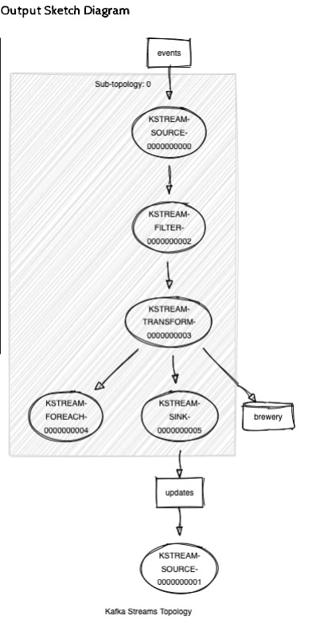
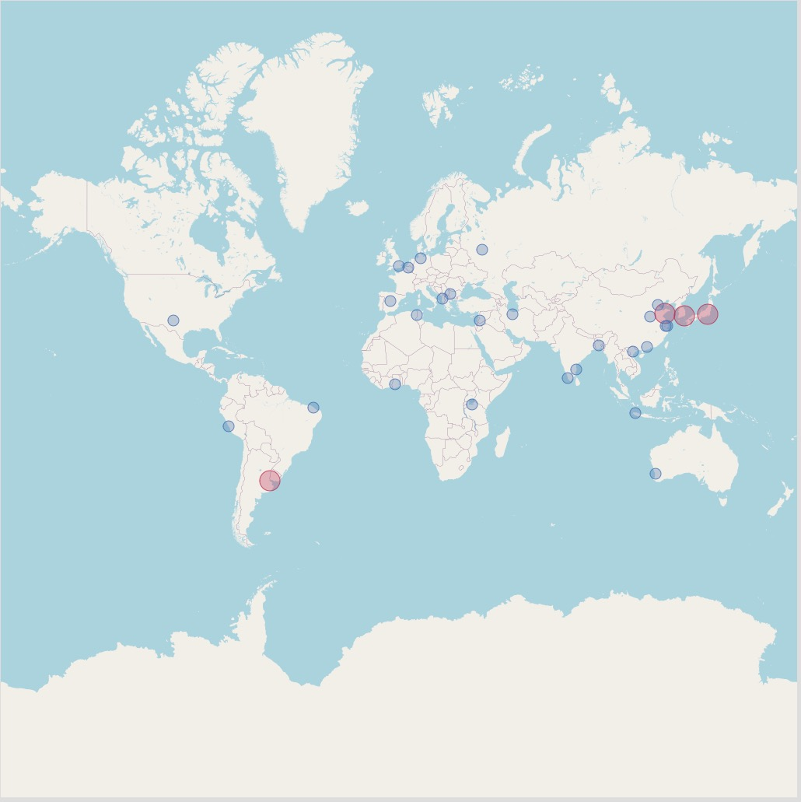
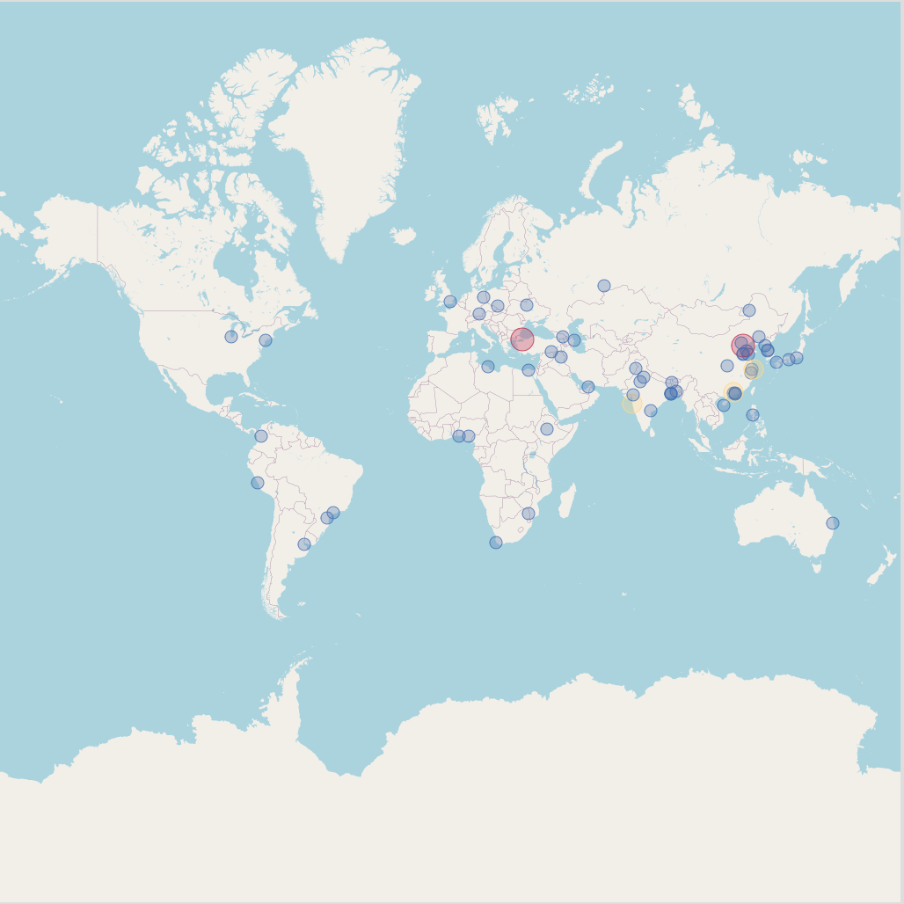
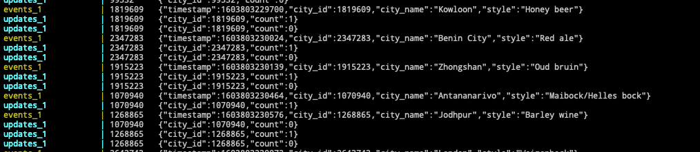

# Lab 3 Report

## Usage

In this lab, as what is required in the "Deliverables", we finished all the code work in the Transformer.scala. We only need to use docker-compose to launch the services, run sbt application, and then we can see the results in the webserver. The only variable to be configured is the window size defined in the Transformer.scala:38, whose function is to specify the interval of the stream schedule. It can also be passed by the first command line argument, for example: sbt shell>: run 10 (the window size is 10 seconds).

Another necessary operation to use our transformer is putting a file named: "beer.styles" in the project root folder. This file works to filter out selected beers and each kind of beer is separated by a new line. For example, a proper filter file can be as follow :
```
Altbier
Amber ale
Barley wine
Berliner Weisse
```

## Functional overview
For the input data stream in the experiment, we used a scala case class to store data in JSON format. Since the input stream data is not serialized, we use circe to decode it.

For the processed data, we did not initially use any Processor API, but declared that the local WindowSizedKVStore manually processed each input data. The problem with this is that we cannot process the old check-in according to the flow time, and if the default window is set, some data will be uncontrollable, which will not meet the requirements of the experimental case. To solve this problem, we chose the Transformer API. This class provides a transform method. We can implement the functions we need more conveniently through the schedule() method provided by the ProcessorContext. We also rewrote the punctuate() method to solve the problem that the data stream is processed synchronously, so that the experiment runs at the same time as the stream.

After completing the data processing, we also encountered the problem that TransformerSupplier could not be added to the topology, and if the data in KStream was directly transformed, the output data could not find the output stream, so we adopted the To in KStream The () method manually declares the output source of the data stream.

Finally, we tested the size of the window as input for many times. Experiments show that when the window is set to 20 seconds, you can see the more obvious point updates on the map.

## Kafka topology and setup

Our topology of transformer application is provided below:



The data flow in the transformer starts from the KSTREAM-SOURCE. In the processor module, "source" here indicates the data enters the processor at this point. After that, a filter will filter out beer styles that we don't care about. In the following part, KSTREAM-TRANSFORM will deserialize and analyze the message, then modify the city-states stored in a KVStore, named "brewery". The "brewery" is a key-value memory storage whose key is city id and value is beer counter. When the values in "brewery" are changed, a message will be sent to the Kafka server (broker) via the "updates" channel. In the topology graph, the message in fact is sent to KSTREAM-SINK because that's the output for the transformer.

There is still one remaining part in the topology graph, called KSTREAM-FOREACH. This part is to print out the debug information (the KVStore states) in the console and it doesn't play a role in transformer functionality.

Most of our application operations are stateless, for example, filtering, communicating with the Kafka server, and processing incoming data. The stateless data contains all messages received from, or to be sent to the Kafka server. The only stateful part of our application is the KVStore because operating KVStore itself is already a kind of state operation.


## Result





The above two outputs are captured when the window size is 10s and 20s respectively.

To demonstrate our transformer application is working normally, we set the window size to 10ms and observer the stream monitor, the screenshot of the stream monitor is provided below:



Because we set the window size to 10 milliseconds, which is short enough to observe the whole life cycle of a Punctuator. There are always two update messages after each event, the first message is to set the "count" to 1 (new Punctuator) and then soon set back to 0 (Punctuator callback and dies). Which means the punctuator is working properly because 10 milliseconds is so short that seldom other events can appear between the two messages.
